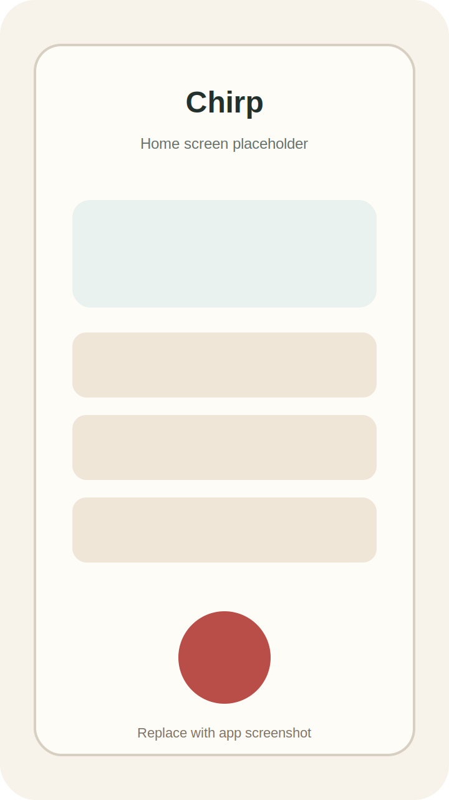
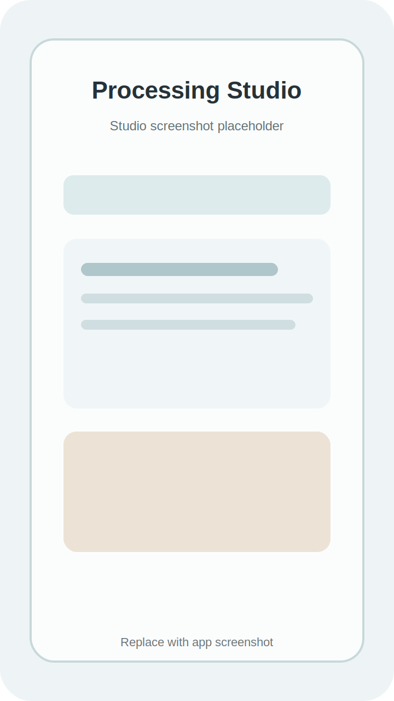
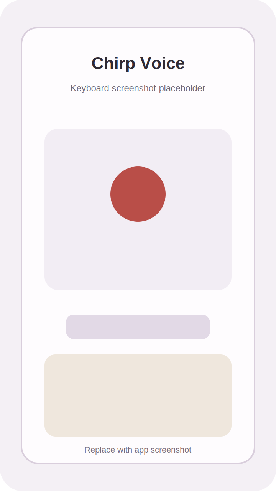

# Chirp

**A small Android voice-notes app for recording, local transcription, and gentle post-processing.**

Chirp is a personal project I'm building while I learn more Android development. It records audio, transcribes speech on-device, and gives me a place to organize, replay, clean up, and export the things I say out loud.

  
  
  

  
  
  
   
  Screenshot placeholders: home, processing studio, and keyboard voice input.

## Why

I love apps like VoiceInk, TypeWhisper, Spokenly, and Superwhisper. A big part of the appeal is that they make excellent speech-to-text feel close at hand, especially with the NVIDIA Parakeet STT model in the mix.

On Android, I kept running into a different shape of tool. Most of the polished options I found were cloud-based, like Typeless and WisprFlow. Those can be useful, but they weren't quite what I wanted. I wanted something that could do the core transcription fully offline, on the device, with API-based LLM post-processing available only when I chose to use it.

Chirp didn't start with all of that figured out. It first started as a recording app. Then transcription became the obvious next step. Then came LLM post-processing for cleanup, summaries, titles, chat, and structured outcomes. After that, using it as an input method felt like the natural next layer: if the app can transcribe my voice, it should also help me put words directly into other apps.

There isn't local LLM support yet. For now, transcription is the offline part, and LLM features are optional API-based processing on top.

## Features

Chirp is meant for the moments when typing is too slow or too fussy. Record something, let the app transcribe it locally, then decide what to do with it afterward.

- Record voice notes from the app.
- Transcribe recordings on-device.
- Keep a searchable recording history with playback.
- Use recording profiles, tags, and word replacements to keep things organized.
- Open a recording in Processing Studio for transcript editing, summaries, structured outcomes, and chat.
- Use a keyboard voice input flow for quick dictation in other apps.
- Start and stop recording from a home-screen widget.
- Export transcripts to Obsidian as Markdown.
- Optionally use AI processing to clean up, summarize, title, or work with transcript text.

## Details

A little more concretely, the app currently includes:

- Foreground recording services for long-running capture.
- Recovery handling for interrupted recordings.
- On-device model download and readiness checks.
- Background transcription work through WorkManager.
- Word-level timing support when the recognizer provides it.
- Recording playback through a shared Media3 playback service.
- Room-backed local storage for recordings, transcripts, tags, profiles, word replacements, and structured processing results.
- Profile-level settings for transcription, AI processing, Obsidian export, and audio behavior.
- API-based LLM features for title generation, summaries, transcript cleanup, passage tools, structured outcomes, and recording-aware chat.

## IME

Chirp can be used as its own dedicated Android input method through **Chirp Voice**. The idea is simple: switch to the keyboard, record, transcribe locally, optionally polish the text, and insert it where you were already typing.

It can also work as a triggered speech recognition service from compatible keyboards and apps that let you choose which speech-to-text app handles voice input. SwiftKey supports this kind of flow. Gboard, sadly, does not currently expose that same choice.

## Stack

The app is built as a Kotlin Android project with Jetpack Compose and a modular feature layout. Under the hood it uses:

- Sherpa-ONNX with a local Parakeet TDT speech model for on-device transcription.
- Jetpack Compose and Material 3 for the UI.
- Room for local storage.
- Hilt for dependency injection.
- WorkManager for background transcription work.
- Media3 for recording playback.
- Optional Gemini-powered processing for summaries, cleanup, chat, and structured outcomes.

The local transcription piece is the heart of the project. AI processing is optional and sits on top of the transcript when I want extra help shaping the text.

## Notes

This isn't a polished product from a team. It's a working personal app, and it's also a learning project.

- All of my hands-on device testing is on a Samsung Galaxy S25 Ultra.
- I'm still learning Android development as I go.
- This project is 100% co-developed with various LLMs. I use them to help me reason through architecture, UI, Kotlin, tests, debugging, and cleanup.
- Some parts are more mature than others, and the repo will probably keep changing as I learn better ways to build it.

## Focus

Right now, I care most about making Chirp reliable for everyday capture:

- recording without losing audio,
- transcription that works locally,
- clear recovery when something gets interrupted,
- a keyboard flow that feels fast enough to use,
- and a studio view that turns raw transcripts into something useful.

## Screenshots

The screenshot files are intentionally left as placeholders for now:

- `docs/screenshots/home.svg`
- `docs/screenshots/studio.svg`
- `docs/screenshots/keyboard.svg`

I'll add real screenshots once the main flows settle down a little more.
