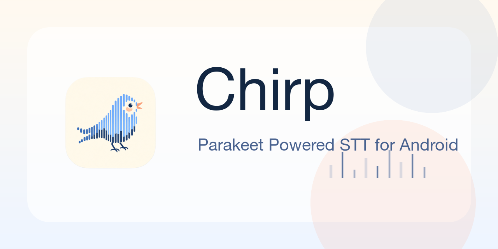
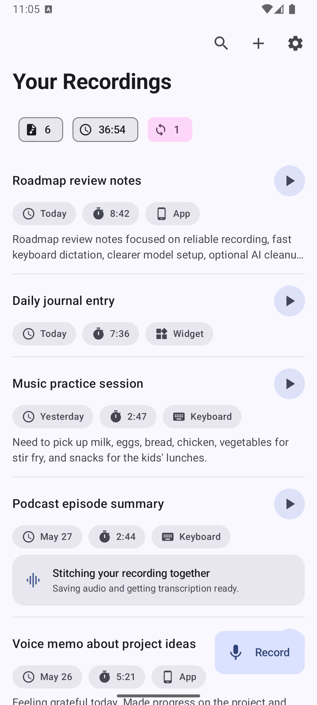
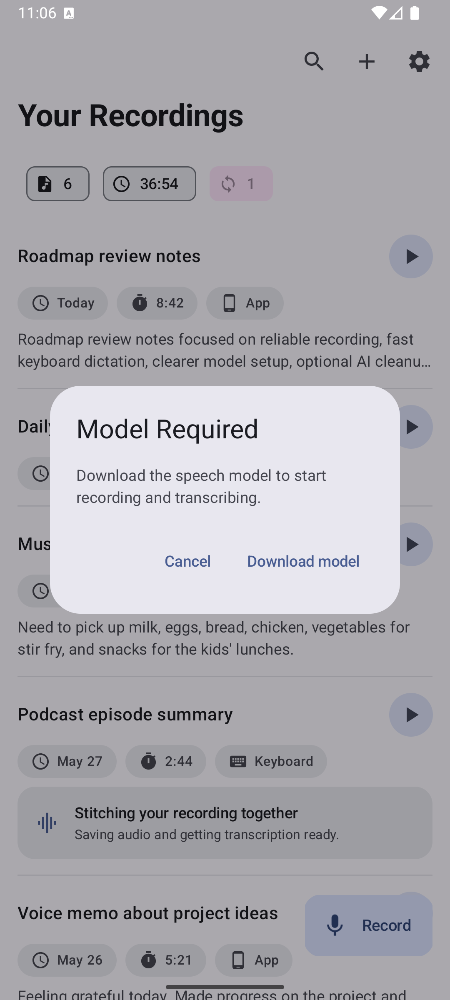
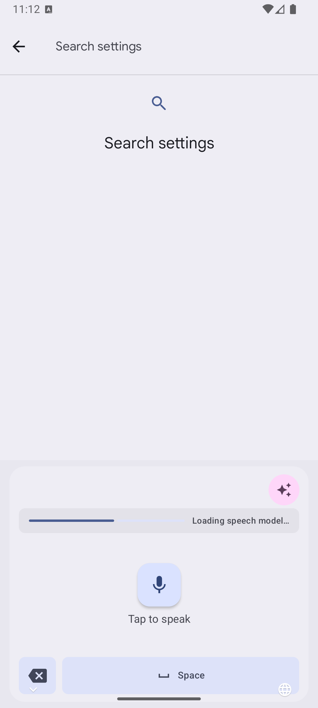
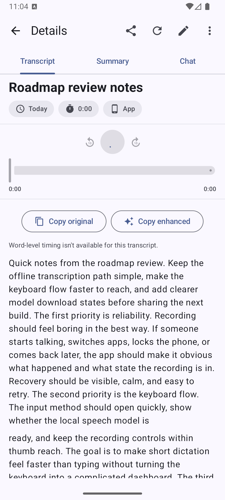
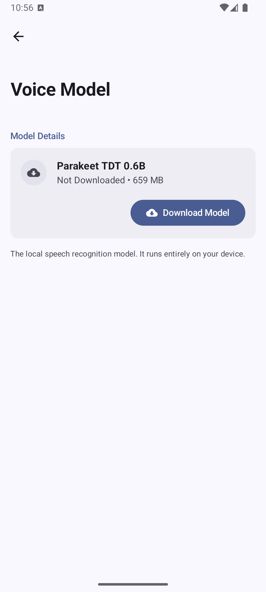
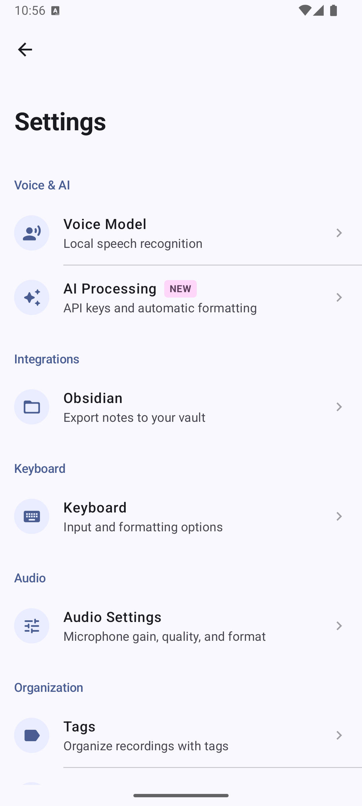
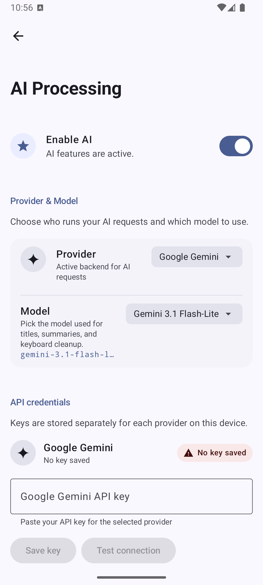
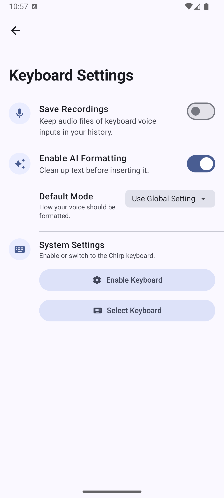
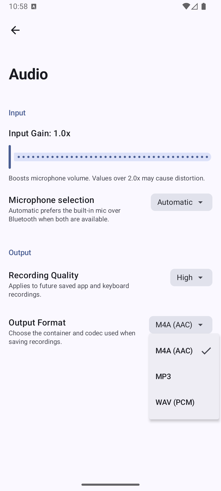

**An Android voice-notes app focused on offline transcription and practical text cleanup.**

Chirp is a personal learning project, built in the open while I get better at Android development. The goal is simple: record thoughts, transcribe them on-device, and turn rough speech into text that is easier to use.

---

  
  
  
  

  
  
  
   
  Home, recording entry point, and Chirp Voice keyboard.
    
  
  
  
   
  Details, model download, and settings.
    
  
  
  
   
  AI processing, keyboard, and audio settings.

## Why

I love apps like VoiceInk, TypeWhisper, Spokenly, and Superwhisper. They make excellent speech-to-text feel close at hand, especially with NVIDIA Parakeet in the mix.

On Android, most polished options I found were cloud-based, like Typeless and WisprFlow. Chirp is my attempt at a local-first alternative: offline transcription first, optional API-based cleanup second.

It started as a recorder, then grew into transcription, LLM cleanup, summaries, and finally an input method. No local LLM support yet. The offline part is speech-to-text.

## Features

- Record voice notes.
- Transcribe on-device.
- Search and play back recording history.
- Organize with profiles, tags, and word replacements.
- Edit, summarize, and explore transcripts in Processing Studio.
- Dictate from Chirp Voice, the keyboard input method.
- Start or stop recording from a home-screen widget.
- Export transcripts to Obsidian as Markdown.
- Optionally use AI processing for cleanup, titles, summaries, structured outcomes, and chat.

## Details

- Foreground recording services for long-running capture.
- Recovery paths for interrupted recordings.
- On-device model download and readiness checks.
- Background transcription work through WorkManager.
- Word-level timing support when the recognizer provides it.
- Recording playback through a shared Media3 playback service.
- Room-backed storage for recordings, transcripts, tags, profiles, word replacements, and processing results.
- Profile-level settings for transcription, AI processing, Obsidian export, and audio behavior.
- API-based LLM features for titles, summaries, cleanup, structured outcomes, and recording-aware chat.

## IME

Chirp can be used as its own Android input method through **Chirp Voice**. Switch keyboards, record, transcribe locally, optionally polish the text, and insert it where you were already typing.

It can also work as a triggered speech recognition service from compatible keyboards and apps. SwiftKey supports this kind of flow. Gboard, sadly, does not currently expose the same choice.

## Stack

Chirp is a Kotlin Android app with Jetpack Compose and a modular feature layout:

- Sherpa-ONNX with a local Parakeet TDT speech model for on-device transcription.
- Jetpack Compose and Material 3 for the UI.
- Room for local storage.
- Hilt for dependency injection.
- WorkManager for background transcription work.
- Media3 for recording playback.
- Optional Gemini-powered processing for summaries, cleanup, chat, and structured outcomes.

Local transcription is the heart of the project. AI processing sits on top.

## License and third-party credits

Chirp's source code is licensed under the [Apache License 2.0](LICENSE). Third-party
libraries, models, fonts, and artwork keep their own licenses.

- Provider logos come from [models.dev](https://github.com/anomalyco/models.dev) and are
  included under its MIT license. Provider names and logos remain trademarks of their
  respective owners.
- MP3 encoding uses
  [AndroidLame-kotlin](https://github.com/banketree/AndroidLame-kotlin), based on
  [TAndroidLame](https://github.com/naman14/TAndroidLame), with LAME 3.100. LAME is licensed
  under the GNU Library General Public License version 2 or later. The corresponding LAME
  source is available from the [official LAME archive](https://sourceforge.net/projects/lame/files/lame/3.100/).
- On-device recognition uses [sherpa-onnx](https://github.com/k2-fsa/sherpa-onnx), licensed
  under Apache 2.0. Its Android runtime includes
  [ONNX Runtime](https://github.com/microsoft/onnxruntime), licensed under MIT.
- The downloaded speech model is an INT8 ONNX conversion by
  [csukuangfj](https://huggingface.co/csukuangfj/sherpa-onnx-nemo-parakeet-tdt-0.6b-v2-int8)
  of [NVIDIA Parakeet TDT 0.6B V2](https://huggingface.co/nvidia/parakeet-tdt-0.6b-v2).
  The model is licensed under [CC BY 4.0](https://creativecommons.org/licenses/by/4.0/).
  The conversion changes the original model to sherpa-onnx ONNX format and applies INT8
  quantization.
- The documentation artwork uses Google Sans Flex through Google Fonts. Google Sans Flex is
  licensed under the SIL Open Font License 1.1.

Copyright notices, full license texts, and source links are collected in
[THIRD_PARTY_NOTICES.md](THIRD_PARTY_NOTICES.md). Chirp's Apache 2.0 license doesn't relicense
any third-party component. The same notices are packaged in the APK under `assets/legal`.

## Notes

This is not a polished product from a team. It is a working personal app and a learning project.

- Hands-on testing currently focuses on arm64-v8a Android hardware.
- I'm still learning Android development as I go.
- This project is 100% co-developed with various LLMs as I learn architecture, UI, Kotlin, testing, debugging, and cleanup.
- Some parts are more mature than others. The repo will keep changing as I learn better ways to build it.

## Focus

Right now, I care most about everyday reliability:

- recording without losing audio,
- transcription that works locally,
- clear recovery when something gets interrupted,
- a keyboard flow that feels fast enough to use,
- and a studio view that turns raw transcripts into something useful.

## Screenshots

These screenshots were captured from a clean Android emulator with sample recordings. No personal recordings are included.
