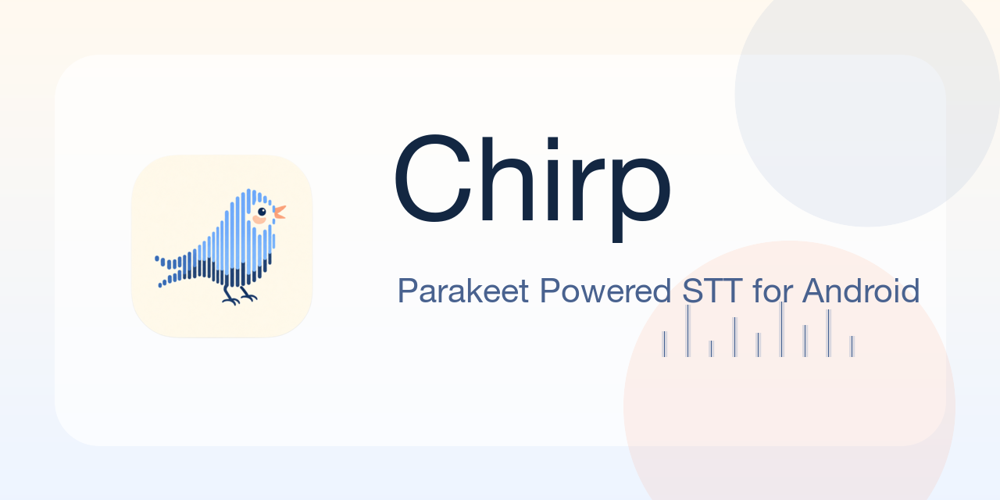
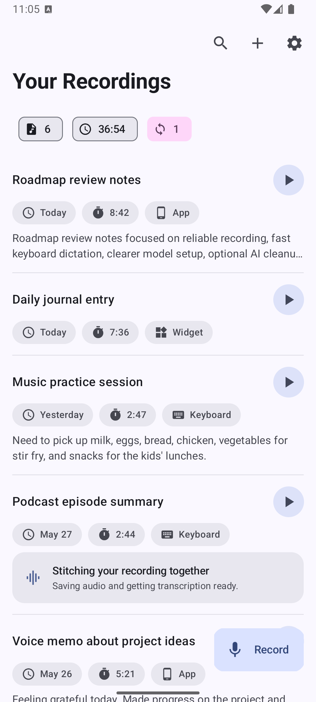
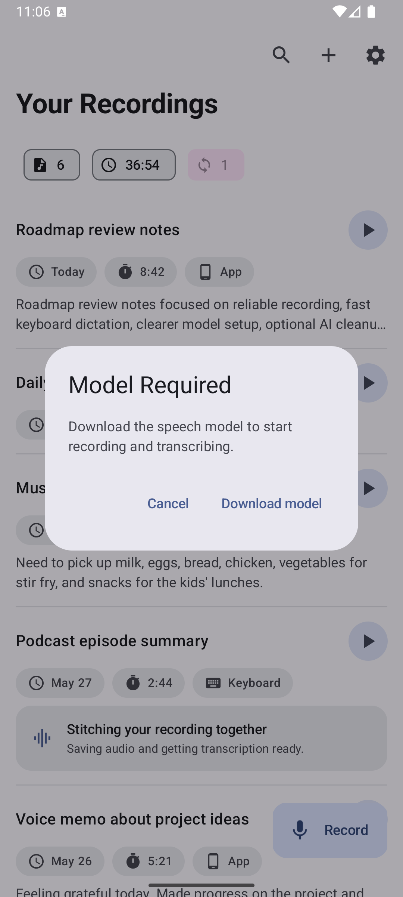
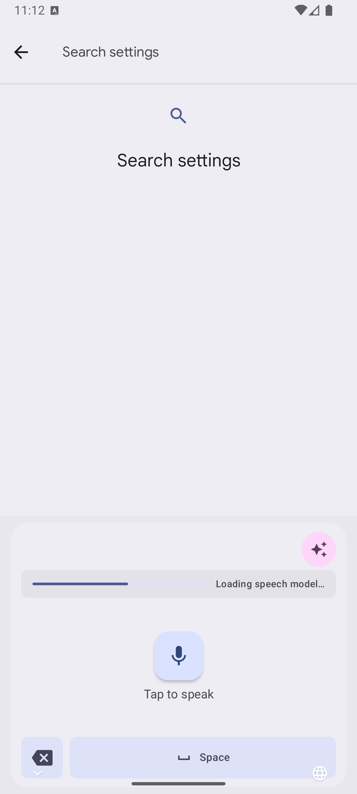
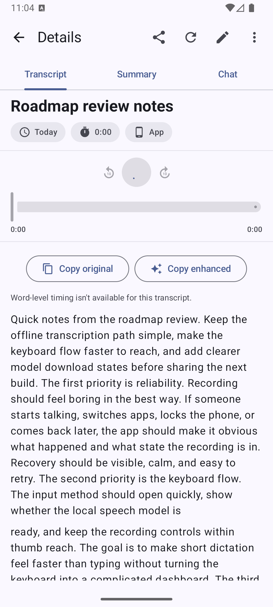
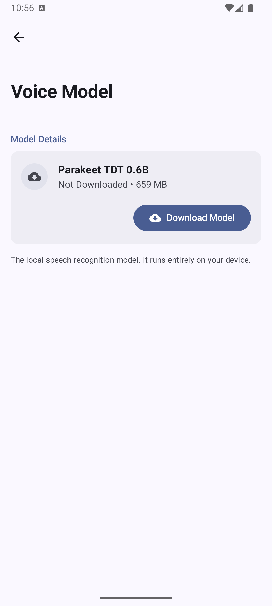
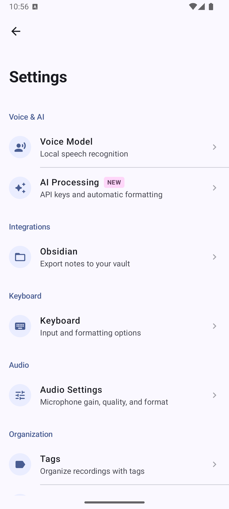
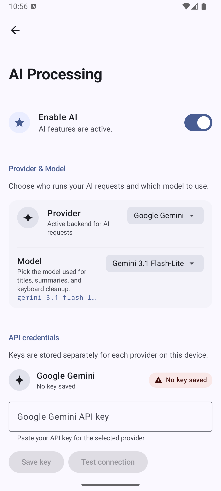
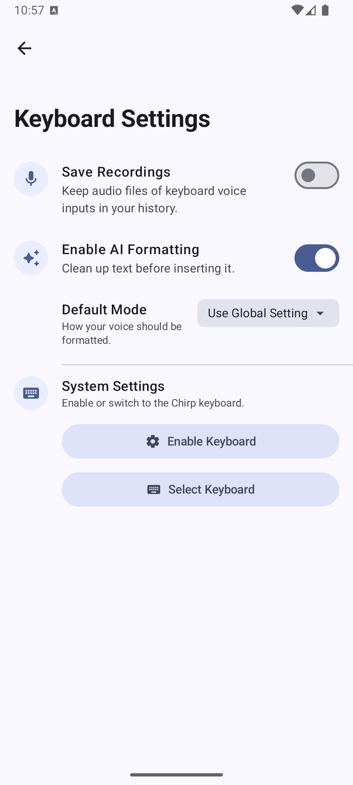
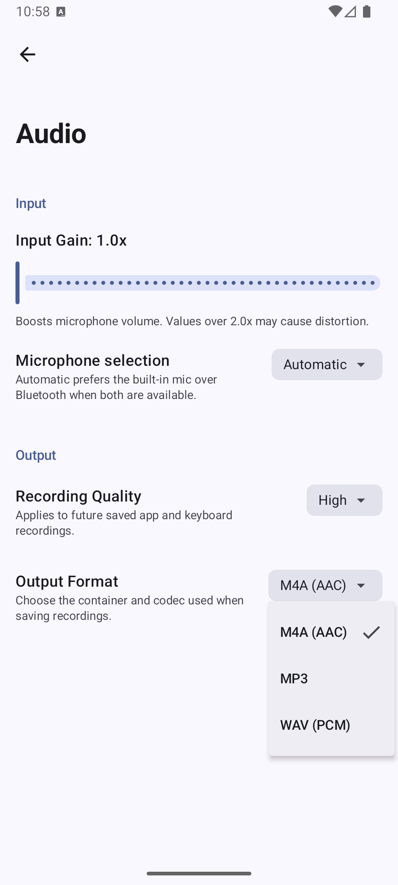

**An Android voice-notes app focused on offline transcription and practical text cleanup.**

Chirp is a personal learning project, built in the open while I get better at Android development. The goal is simple: record thoughts, transcribe them on-device, and turn rough speech into text that is easier to use.

> **AI disclosure:** Chirp was built with extensive AI assistance, primarily from Google Gemini. It's a learning project, so review and test the code before relying on it.

> **Privacy note:** Speech-to-text runs on-device. If you enable optional AI processing, the text you process is sent to the provider you choose using your own API key.

---

  
  
  
  

  
  
  
   
  Home, recording entry point, and Chirp Voice keyboard.
    
  
  
  
   
  Details, model download, and settings.
    
  
  
  
   
  AI processing, keyboard, and audio settings.

## Why

I love apps like VoiceInk, TypeWhisper, Spokenly, and Superwhisper. They make excellent speech-to-text feel close at hand, especially with NVIDIA Parakeet in the mix.

On Android, most polished options I found were cloud-based, like Typeless and WisprFlow. Chirp is my attempt at a local-first alternative: offline transcription first, optional API-based cleanup second.

It started as a recorder, then grew into transcription, LLM cleanup, summaries, and finally an input method. No local LLM support yet. The offline part is speech-to-text.

The primary reliability rule is that captured speech must never disappear. The concrete capture, recovery, transcription, and AI invariants live in [the lossless dictation mandate](docs/lossless-dictation-mandate.md).

## Features

- Record, search, and play voice notes with on-device transcription.
- Dictate into other apps with Chirp Voice or control recording from a home-screen widget.
- Organize recordings with profiles, tags, and word replacements, then export them to Obsidian as Markdown.
- Edit transcripts in Processing Studio, with optional API-based cleanup, titles, summaries, structured outcomes, and chat.

## Download

Download the latest installable APK from [GitHub Releases](https://github.com/hkay-dev/chirp-android/releases/latest).
Chirp 4.0 requires Android 16 and downloads the speech model during setup.

## Details

- The compact Parakeet 110M GGUF model is the default. A larger sherpa-onnx model is still available.
- Foreground recording, WorkManager transcription, and recovery paths handle longer or interrupted recordings.
- Room stores recordings, transcripts, organization, and processing results. Media3 handles playback.
- Profiles can set transcription, AI processing, Obsidian export, and audio defaults.
- Baseline Profiles cover app startup, IME startup, and keyboard settings.

## IME

Chirp can be used as its own Android input method through **Chirp Voice**. Switch keyboards, record, transcribe locally, optionally polish the text, and insert it where you were already typing.

The keyboard also has a private background-transcription path under development. Cloud-routed dictation gets a synced journal and final app-private audio path before recording starts, so a killed IME can be recovered into Room and WorkManager on the next process start. It then uses Google Cloud Chirp 3 and optional Vertex cleanup. The architecture, privacy boundary, failure rules, and auth checkpoint live in [the cloud dictation design](docs/google-cloud-dictation-design.md).

It can also work as a triggered speech recognition service from compatible keyboards and apps. SwiftKey supports this kind of flow. Gboard, sadly, does not currently expose the same choice.

## Stack

Chirp is a Kotlin Android app with Jetpack Compose and a modular feature layout:

- transcribe.cpp GGUF with the compact Parakeet TDT/CTC 110M Q8 model as the default, plus the
  larger Sherpa-ONNX Parakeet TDT 0.6B model as an option.
- Jetpack Compose and Material 3 for the UI.
- Room for local storage.
- Hilt for dependency injection.
- WorkManager for background transcription work.
- Media3 for recording playback.
- Optional multi-provider processing (Gemini, OpenAI, Anthropic, Groq, Cerebras) for summaries, cleanup, chat, and structured outcomes.

Local transcription is the heart of the project. AI processing sits on top.

The selected local recognizer stays resident across dictations, IME hides, app switches, and idle
time. Chirp releases it only for confirmed memory pressure, severe thermal throttling, an explicit
model switch or deletion, or process death, never during active capture or transcription. Model
warmup does not open the microphone. Profiling and regeneration steps live in
[the performance guide](docs/performance.md).

## License and third-party credits

Chirp's source code is licensed under the [Apache License 2.0](LICENSE). Third-party
libraries, models, fonts, and artwork keep their own licenses.

- Provider logos come from [models.dev](https://github.com/anomalyco/models.dev) and are
  included under its MIT license. Provider names and logos remain trademarks of their
  respective owners.
- MP3 encoding uses
  [AndroidLame-kotlin](https://github.com/banketree/AndroidLame-kotlin), based on
  [TAndroidLame](https://github.com/naman14/TAndroidLame), with LAME 3.100. TAndroidLame is
  licensed under GPL 3.0 or later, while LAME is licensed under the GNU Library General Public
  License version 2 or later. AndroidLame-kotlin doesn't publish a separate license for its added
  wrapper code. The corresponding LAME source is available from the
  [official LAME archive](https://sourceforge.net/projects/lame/files/lame/3.100/).
- On-device recognition uses [sherpa-onnx](https://github.com/k2-fsa/sherpa-onnx), licensed
  under Apache 2.0. Its Android runtime includes
  [ONNX Runtime](https://github.com/microsoft/onnxruntime), licensed under MIT.
- The downloaded speech model is an INT8 ONNX conversion by
  [csukuangfj](https://huggingface.co/csukuangfj/sherpa-onnx-nemo-parakeet-tdt-0.6b-v2-int8)
  of [NVIDIA Parakeet TDT 0.6B V2](https://huggingface.co/nvidia/parakeet-tdt-0.6b-v2).
  The model is licensed under [CC BY 4.0](https://creativecommons.org/licenses/by/4.0/).
  The conversion changes the original model to sherpa-onnx ONNX format and applies INT8
  quantization.
- The documentation artwork uses Google Sans Flex through Google Fonts. Google Sans Flex is
  licensed under the SIL Open Font License 1.1.

Copyright notices, full license texts, and source links are collected in
[THIRD_PARTY_NOTICES.md](THIRD_PARTY_NOTICES.md). Chirp's Apache 2.0 license doesn't relicense
any third-party component. The same notices are packaged in the APK under `assets/legal`.

## Notes and focus

This is a working personal app and a learning project, not a polished team product. I'm still learning Android development.

- Builds target **arm64-v8a only** (`ndk.abiFilters` in `app/build.gradle.kts`) because the app
  is sideloaded onto a single physical device. Remove that filter (or add `x86_64`) before
  building for an emulator or any other device.
- Release builds are non-debuggable, R8-minified, and resource-shrunk.

Every hands-on test so far has been on my Galaxy S25 Ultra. It's the only Android device I have available, and I'd be very interested to hear how Chirp works on anything else.

Right now, I'm focused on recording without losing audio, local transcription, clear recovery when something gets interrupted, a keyboard flow that feels fast enough to use, and a studio view that turns raw transcripts into useful text.
