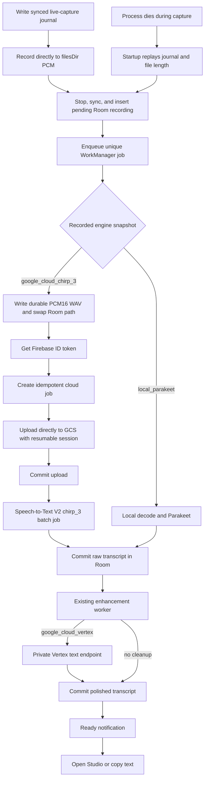

# Durable Google Cloud dictation

## Decision

Chirp Keyboard will have two transcription paths.

- **Local inline** keeps the current Parakeet flow. It is fast, writes back into the active field, and stays on the device. Its first complete PCM block creates an asynchronous ownership checkpoint, so a later process can recover every complete float left in the file. Pick cloud background when queued delivery matters more than immediate insertion.
- **Cloud background** makes the audio durable before any speech model runs. It sends the saved recording to a private Cloud Run service, transcribes it with Google Cloud Speech-to-Text V2 `chirp_3`, runs optional Vertex AI cleanup as a separate step, saves both raw and polished text, and notifies the user when the result is ready.

Cloud background mode never keeps an `InputConnection` alive and never streams partial text into the field. The recording and queue row are the source of truth. Before AudioRecord starts, the app writes and syncs a live-capture journal and gives the recorder its final app-private path. Every completed PCM write goes straight to the file descriptor rather than sitting in a userspace output buffer. A later process instance replays an interrupted capture from its first complete audio block. The current process token stops the delayed startup pass from claiming a recording that is still live.

## Why the existing path loses work

The keyboard currently stops into a file-backed float PCM source, then launches local STT and LLM work as a child of the IME service scope. The audio only becomes a normal Room recording at the end of that inline pipeline or during rescue. If Android destroys the IME or the target field changes, the pipeline has to recover from a lifecycle event that has nothing to do with transcription.

The cloud path cuts that ownership link. Its ownership order starts before the microphone.

1. Resolve the engine once. Cloud writes a synced live-capture journal with a new recording UUID and settings snapshot. Local keeps a pathless route snapshot so changing the setting mid-recording cannot upload a local-started capture.
2. Record directly into that UUID's app-private durable PCM file.
3. Stop and sync the file, mark the journal ready, and insert a `PENDING_TRANSCRIPTION` Room row.
4. Claim and enqueue the existing unique WorkManager job.
5. Clear the journal and release the IME recording state.

If the process dies before the Room insert, startup derives the duration from the durable float PCM length and restores the same UUID and settings. If it dies after the insert, replay sees the existing row and only clears the journal. The Room insert must happen before enqueue. If enqueue fails, the row stays pending and the existing startup reconciler reattaches it. Older cache-backed handoffs still have their move journal, so upgrading does not weaken recovery for a capture already in flight. Startup also promotes a valid synced `.partial` marker left by a process death inside the marker rename window.

## Data flow

## Room snapshot

Routing has to be stored on the recording, not read from live settings during every retry. A setting change must not switch an already queued recording to another provider.

The additive Room migration pins every old row to the local engine so installing this build cannot reroute work that was already queued. New rows may start with a null engine only until the queue stamps the selected default.

- `transcriptionEngineId`, with `NULL` meaning the queue has not stamped a new row yet
- `requestedProcessingModeId`
- `requestedLlmProviderId`
- `requestedLlmModelId`
- `notifyWhenReady`
- `terminalNotificationPending`
- `enhancementRequestSnapshotted`

The keyboard background handoff writes these fields at insert time. Normal recorder jobs stamp any missing routing values once, before claiming the transcription execution token. Queue recovery keeps the same values.

## Android cloud contract

The cloud client is a file-level transcription engine used by `TranscriptionWorker`. It does not implement `TranscriberProvider`. That provider is built around local model readiness and overlapping PCM chunks, which is the wrong shape for one idempotent cloud audio job.

The worker keeps its existing ownership token and commit transaction.

1. Claim the Room row using its execution token.
2. Check that the durable audio file exists.
3. Pick the file-level engine from the recording snapshot.
4. Get one final raw transcript.
5. Apply word replacements.
6. Commit transcript, timing data, and any enhancement snapshot in the existing transaction.
7. Commit the terminal Room state with its pending-notification marker still set.
8. Post the stable per-recording notification and clear that marker only after the post succeeds.

Cloud HTTP failures map this way.

Cloud transcription requests add WorkManager's connected-network constraint. A row already over the one-hour or 256 MiB Speech limit skips that constraint so its atomic local fallback can start offline. Local transcription jobs keep their existing constraints.

- `401` and `403` stop the job with an authentication error.
- A GCS upload-session `400` or `412`, an expired session, and a retryable commit `422` get one fresh server session in the same worker run.
- Other permanent `4xx` responses stop the job and keep the audio.
- Network errors, `408`, `429`, and `5xx` responses return the row to its recoverable pending state and let WorkManager retry.
- A Vertex cleanup failure keeps the raw Speech-to-Text transcript saved and available. The recording stays failed only so cleanup can be retried.

## Private cloud API

Dictation creation uses the local recording UUID as its idempotency key. Text generation uses a SHA-256 key over that recording UUID and the exact request body, so identical prompts from different recordings cannot collide. The Firebase UID is also part of every server-side key, so one account cannot address another account's work.

### `POST /v1/dictations`

Creates or returns the existing job. The request includes the recording UUID, byte count, content type, duration, language, audio checksum, and requested cleanup snapshot. If audio is still needed, the response includes a short-lived GCS resumable upload session URI.

### Direct GCS upload

Android saves the active session URI with the audio checksum and byte count, prefers that matching checkpoint on retry, and queries the committed range before sending another chunk. If that saved session is expired, invalid, checksum-rejected, or precondition-rejected, Android clears it and falls back once to the fresh create or retry session. The URI acts as a bearer secret. It must never appear in logs or analytics.

### `POST /v1/dictations/{id}/commit`

Checks object existence, size, and checksum, then starts a Speech-to-Text V2 batch job exactly once as far as the durable job record can prove. The endpoint returns immediately.

### `GET /v1/dictations/{id}`

Returns the current state and does one bounded reconciliation pass. When Speech finishes, the server reads the provider result, saves the raw transcript, and returns it to Android.

### `POST /v1/text:generate`

Runs one authenticated Vertex Gemini text request for the existing enhancement worker. Android sends the raw transcript, the fully resolved Chirp processing prompt, a stable request key, and the original recording UUID in `Recording-Id` after Speech finishes. The backend accepts generation only for that account's ready dictation, links the generation row to it, and deletes linked generation rows with the dictation. It stores the request hash and finished response, so normal retries of a lost HTTP response return the same text without another Vertex call. An ambiguous provider timeout stays leased for 10 minutes. Recovery may make one more billable call after that lease expires because Vertex `generateContent` has no operation lookup or provider idempotency key. This keeps built-in, custom, and Smart processing modes identical to the current app while moving Gemini billing and credentials into the GCP project.

### `POST /v1/dictations/{id}/retry`

Retries a terminal provider failure against the original durable audio and saved settings.

### `DELETE /v1/dictations/{id}`

Deletes cloud audio, provider output, transcript state, and the Firestore job. Local deletion remains a separate user action. Android does not call this endpoint yet, so Firestore TTL is the deletion fallback for this release.

### `GET /healthz`

This is the only route that does not need an app user token. It returns no project, bucket, account, or model details.

## Cost guardrails

The backend keeps per-user UTC-day counters in Firestore and stops new work before a Google API call once a counter is full. The defaults allow 50 new dictations, 2 GiB of audio, 12 hours of declared audio, 75 Speech submissions, and 200 Vertex requests per day. Each recording may have at most 20 linked Vertex generations. Idempotent replays do not spend the counters again.

These caps limit what the private service can start, including with a stolen user token. They are not a Google Cloud billing hard stop, so project budgets and billing alerts still matter.

## Google Speech settings

The first cloud engine uses one batch path for all recordings.

- Speech-to-Text API V2
- `us` multi-region endpoint
- implicit recognizer `projects/{project}/locations/us/recognizers/_`
- model `chirp_3`
- automatic decoding for the recording's durable PCM16 WAV file
- language `en-US`
- automatic punctuation and capitalization
- no word-level timestamps
- no data logging opt-in

Chirp 3 batch recognition is documented for recordings up to about one hour. Word timestamps cut that to about 20 minutes, so they stay off. File-backed keyboard capture now runs for one hour rather than the old ten-minute in-memory cap. A queued file over one hour or 256 MiB is atomically pinned to local Parakeet before any cloud request, and the same durable audio stays available if the local model needs to be downloaded. Ordered splitting into sub-hour files is the follow-up once real recordings show that limit is common.

The keyboard handoff starts with the original float PCM file so leaving the text field stays fast. The background worker writes a PCM16 WAV beside it, checks that the WAV exists, and token-guardedly swaps the recording row to that WAV. Only that worker may delete the raw duplicate, and only after the row points at the finished WAV. A crash before the swap leaves the row on the valid raw file. A crash after the swap leaves it on the valid WAV. Home and Studio hide audio playback and sharing while the row still points at raw PCM. The cloud provider uploads the durable WAV and keeps it for playback, sharing, retries, and local recovery.

## Vertex cleanup

Cleanup is optional and never overwrites the raw transcript. Speech and cleanup stay as two jobs, just like Chirp's current local transcription and enhancement workers.

- `rawTranscript` is the literal Speech-to-Text result.
- `polishedTranscript` is a separate Vertex result.
- The Room enhancement snapshot stores the prompt and requested provider. The backend returns the model version used for the request.
- A cleanup error leaves the raw text in Room and marks only the enhancement work failed, so the user can open the transcript and retry cleanup.
- The model name is deployment config, not an Android constant.

If the connection dies after Vertex may have accepted a request, the backend keeps the generation in progress for 10 minutes rather than calling Vertex again immediately. One retry is allowed after that lease expires. That can double-bill one generation in the worst case, but it cannot overwrite or lose the raw Speech-to-Text transcript.

The existing Android Gemini provider uses the Gemini Developer API and an API key. It is not silently reused or renamed as Vertex because the auth and billing paths are different. Cloud background dictation snapshots `google_cloud_vertex`, so the existing enhancement worker calls the private text endpoint with the mode prompt it already resolved from the raw transcript.

## Authentication and IAM

The Android app signs in with Google through Firebase Authentication and sends its Firebase ID token in `Authorization: Bearer ...`. Cloud Run allows network access to the service, then verifies the token before any `/v1/*` handler runs. The backend checks token revocation, `email_verified`, and one configured Firebase UID.

The APK never contains a service-account key, Speech credential, Storage credential, or Vertex credential. Cloud Run uses its attached service account through Application Default Credentials.

The runtime service account gets only these roles.

- `roles/speech.client` on the project
- `roles/datastore.user` on the project
- `roles/firebaseauth.viewer` on the project when revoked-token checks are on
- `roles/aiplatform.user` on the project only when Vertex cleanup is on
- `roles/storage.objectUser` on the dedicated bucket

The bucket uses uniform access and public access prevention. The bootstrap reapplies both controls and disables soft delete and Object Versioning when the bucket already exists. Audio object names use random IDs, never recording titles. A lifecycle rule deletes source audio after 30 days and keeps provider output for 31 days, so a phone that stays offline can still import a finished result throughout the job's 30-day lifetime. Every Firestore job stores an `expiresAt` timestamp 30 days after creation, and a TTL policy deletes the job and transcript asynchronously after that timestamp. No retention lock is used, so an explicit delete works immediately.

## Incognito fields

Fields marked `IME_FLAG_NO_PERSONALIZED_LEARNING` stay on the existing local inline path. Cloud background mode creates a permanent local inbox item and sends audio off-device, which conflicts with the field's privacy signal. Chirp will not silently do that.

## Notifications

The ready notification is tied to the Room recording, not the cloud job.

- Tapping it opens that recording in Processing Studio.
- The notification uses generic private copy and never includes transcript text.
- Copying stays inside Processing Studio in the first implementation.
- It posts after enhancement when enhancement was requested, or after transcription when it was not.
- The recording UUID is the notification ID, so a repeat post replaces the existing notification instead of making another card.
- `notifyWhenReady` is the immutable request snapshot. `terminalNotificationPending` tracks delivery separately, so a retry can re-arm the notification and clearing a posted notification cannot change enhancement privacy settings.
- Startup and each enabled app resume replay terminal rows whose pending bit is still set. Reopening Chirp after granting notification permission or turning its channel back on therefore posts the waiting notification. Android keeps the bit while delivery is blocked, and a repeat post is idempotent if the process died between posting and clearing it.

## Failure invariants

- Cloud-routed audio has a synced journal before capture begins and writes directly to durable storage.
- Captured audio is never deleted until a durable destination owns it, except for an explicit user cancel.
- A process kill during cloud capture can lose only an AudioRecord block that never finished writing. Device loss or storage failure can still destroy data, so this is crash tolerance rather than a mathematical no-loss guarantee.
- A Room row never points at a cache file.
- Queue failure never deletes the Room row or audio.
- Worker death never changes the chosen provider or cleanup settings.
- A stale worker cannot commit over a newer execution token.
- Cloud deletion never deletes the local recording.
- Cloud auth failure never falls back to an undeclared provider and surprises the user.
- Raw Speech-to-Text text stays available when cleanup fails.
- No token, resumable upload URI, audio, transcript, or prompt text is logged.

## Auth checkpoint

Everything before live provisioning can be built and tested with fake auth and provider adapters. The first live step needs these values from the owner.

- A billing-linked Google Cloud project ID
- Permission to run `gcloud auth login` and `gcloud auth application-default login`
- The Google account that may use the service

Live provisioning can then create the runtime service account, Firestore database, private bucket, IAM bindings, Cloud Run service, Firebase Google provider, and Android OAuth client. Firebase app registration provides `google-services.json`, and the first Google sign-in creates the Firebase UID. Neither is an input the owner has to find beforehand.

The authenticated handoff runs in this order so the Firebase UID and Cloud Run allowlist do not depend on each other.

1. Confirm the billing-linked project and sign the Firebase CLI into the chosen Google account.
2. Add Firebase to that project, register `dev.chirpboard.app` with the recovered SHA-1, enable Google sign-in, and download `google-services.json`.
3. Replace the fake Android token provider with Firebase Auth, add the one-time Google sign-in screen, and build a private signed APK.
4. Sign in once on the phone and read that account's Firebase UID.
5. Run the checked-in bootstrap, deploy Cloud Run with that UID as the only allowed user, and write the returned HTTPS URL into the private Gradle build property.
6. Build and install the final APK, run a short live dictation, kill the IME during a second dictation, and check recovery, notification, copy, retry, and local audio playback.

The original private-build signing key was recovered from the March 24 Time Machine backup and restored to `~/.android/debug.keystore`. Its SHA-1 is `45:D6:44:7D:26:7C:1D:42:0A:7B:1E:4D:59:4C:75:E9:47:75:DA:52`, ready for the Firebase Android app registration. The accepted Android SDK license was recovered too, and Gradle installed Platform 36, Build Tools 35, and the needed platform tools. Android compilation, local unit tests, and Room v12 schema export now run on this Mac. The `gcloud beta` commands used by the bootstrap and Firebase CLI 15.24.0 are installed. Firebase CLI has not been signed in.

## Official references

- [Chirp 3 model support and limits](https://docs.cloud.google.com/speech-to-text/v2/docs/chirp-model)
- [Speech-to-Text V2 batch recognition](https://docs.cloud.google.com/speech-to-text/docs/batch-recognize)
- [BatchRecognize REST contract](https://docs.cloud.google.com/speech-to-text/docs/reference/rest/v2/projects.locations.recognizers/batchRecognize)
- [Cloud Storage resumable uploads](https://cloud.google.com/storage/docs/performing-resumable-uploads)
- [Cloud Run end-user authentication](https://cloud.google.com/run/docs/authenticating/end-users)
- [Firebase Google sign-in on Android](https://firebase.google.com/docs/auth/android/google-signin)
- [Gemini 3.6 Flash model details](https://docs.cloud.google.com/gemini-enterprise-agent-platform/models/gemini/3-6-flash)
- [Service-account key guidance](https://cloud.google.com/iam/docs/best-practices-for-managing-service-account-keys)
- [Cloud Run request limits](https://cloud.google.com/run/quotas)
